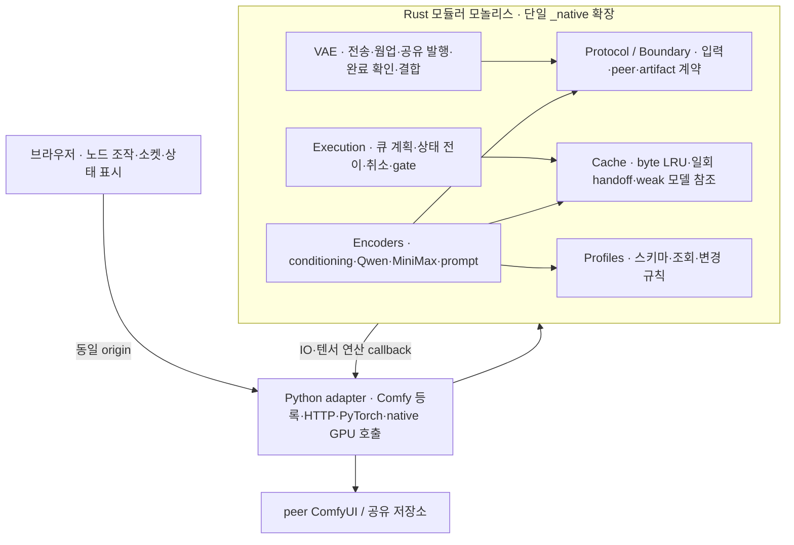

# C3 · RemoteWorker 컴포넌트

```mermaid
flowchart TB
    UI["브라우저 · 노드 조작·소켓·상태 표시"]
    Adapter["Python adapter · Comfy 등록·HTTP·PyTorch·native GPU 호출"]
    subgraph Native["Rust 모듈러 모놀리스 · 단일 _native 확장"]
        Boundary["Protocol / Boundary · 입력·peer·artifact 계약"]
        Encoders["Encoders · conditioning·Qwen·MiniMax·prompt"]
        Profiles["Profiles · 스키마·조회·변경 규칙"]
        Execution["Execution · 큐 계획·상태 전이·취소·gate"]
        Cache["Cache · byte LRU·일회 handoff·weak 모델 참조"]
        VAE["VAE · 전송·웜업·공유 발행·완료 확인·결합"]
        Encoders --> Boundary
        Encoders --> Cache
        Execution --> Cache
        VAE --> Boundary
        Encoders --> Profiles
    end
    UI -->|동일 origin| Adapter
    Adapter --> Native
    Native -->|IO·텐서 연산 callback| Adapter
    Adapter --> Peer["peer ComfyUI / 공유 저장소"]
```

## 실행·실패 계약

- 호출 측·peer 각각의 ComfyUI 프로세스 내부 native 모듈 로드
- 검증된 ID·정책·미디어 종류·슬롯 단계의 Rust 타입 소유 · 외부 입력의 런타임 검증 후 구성
- Python 예외의 FFI 전달 · 실패 시 해당 prompt 취소 · 업로드 성공분의 요청별 정리
- 공유 파일 원자 발행·검증: [shared-video](../contracts/shared-video.md)
- native 바이너리 필수
- 이벤트 adapter: 원래 Comfy 전송 선행·문자열 상태의 native 관찰·binary 미리보기 분리 · [C4](04-code.md#준비파이프라인)
- 프로세스 종료 수명주기: [pipeline](../contracts/pipeline.md) · [native-runtime](../contracts/native-runtime.md)

## 도메인 계약

- [준비·메모리](../contracts/preparation.md)
- [파이프라인·원래 작업 미리보기](../contracts/pipeline.md)
- [공유 latent·영상·텐서](../contracts/shared-video.md)
- [파일 결합·최종화](../contracts/file-finalization.md)
- [노드 경험](../contracts/node-experience.md)
- [C4 코드 라우팅](04-code.md)
